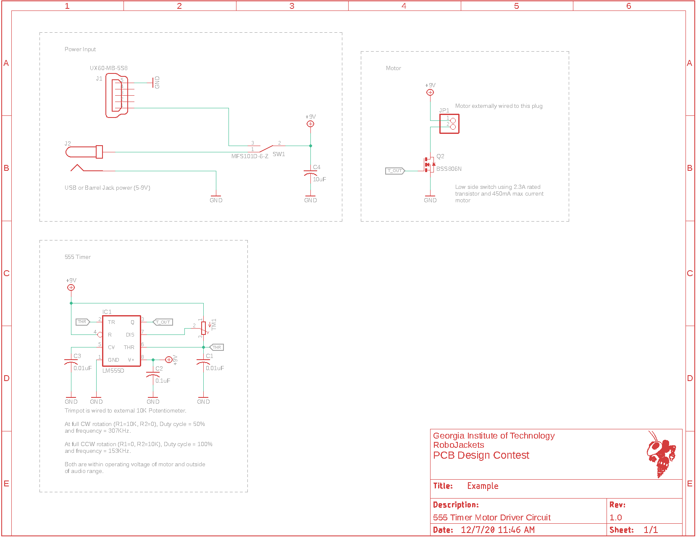
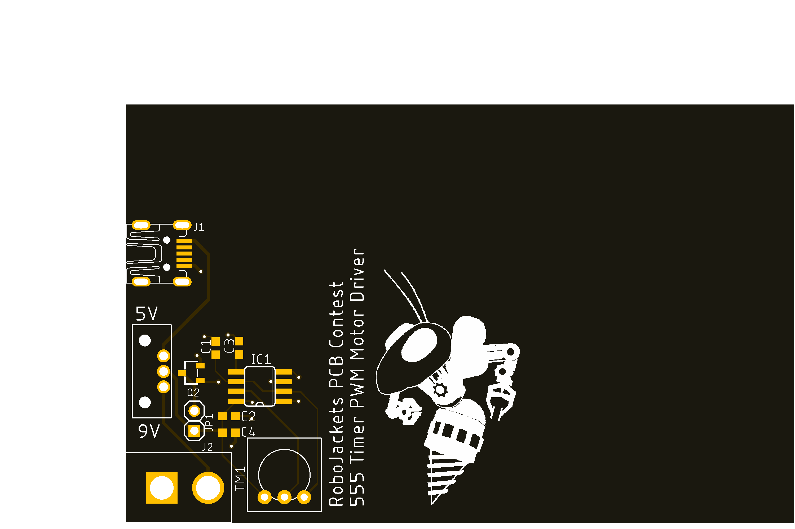
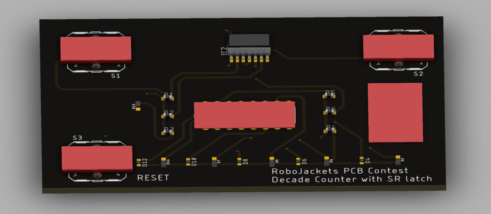

# SR Latch & Decade Counter Game

## Overview

Using an SR latch as the clock input for a decade counter to light up LEDs. The goal is to light up all the LEDs in the fastest time possible.

## Power Input

Two 3.0V coin cell lithium-ion batteries.

## SR Latch

Using two NOR gates on an IC. An LED will confirm the state of the SR latch.

## Decade Counter

Edge-triggered component that outputs high for a new pin every clock cycle.

## Firmware

This board does not have any programmable components so no firmware is required.

## Images

Schematic:

Board:

3D Render:

